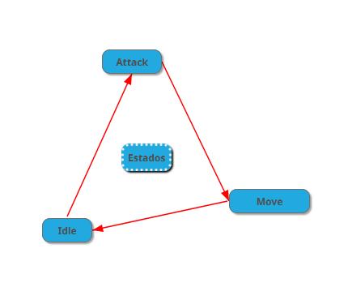
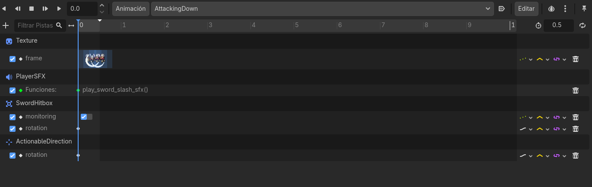

## Sobre la máquina de estados:

- Para implementar sistemas en referencia al jugador acceder al Script ligado al nodo Player (Player.gd), en caso de realizar operaciones que tengan que ver
con estados del jugador, como por ejemplo recibir daño, puedes crear otro estado nuevo, o realizar las operaciones sobre los estados ya existentes a través
de la llamada a controlled_node

Ejemplo de controlled_node:
```gdscript

extends StateBase

@export var animations: AnimationPlayer;
@export var actionable_finder: Area2D 

func on_physics_process(_delta):
	if Game.is_in_dialogue:
		return

	controlled_node.velocity = Vector2.ZERO
	animations.play("Idle" + controlled_node.current_direction) # Aquí llamo a controlled_node, 
	# que en este caso es la referencia a Player.GD donde existe una variable utilizada para 
	# obtener la dirección actual almacenada en una variable referenciada en el padre.

func on_unhandled_input(_event):
	if Input.is_action_just_pressed("Interact"):
		var actionables = actionable_finder.get_overlapping_areas()
		if actionables.size() > 0:
			actionables[0].action()
			return

func on_input(_event):
	if Game.is_in_dialogue:
		return
	
	if Input.is_action_just_pressed("Attack"):
		state_machine.change_to("PlayerStateAttack")
		return
	elif Input.is_action_pressed("Down") \
	or Input.is_action_pressed("Up") \
	or Input.is_action_pressed("Left") \
	or Input.is_action_pressed("Right"):
		state_machine.change_to("PlayerStateWalk")
		return
```

> ***Básicamente, si vas a hacer referencia a información que está en el padre, utiliza controlled_node en un script de un estado (máquina de estados)***

- A través de scripting con la máquina de estados hacemos que cada una de las funciones de las animaciones funcionen, el ejemplo de arriba simplemente es el cambio desde Idle (sin movimiento) a cualquier otra acción, todos los estados hacen lo mismo, aquí dejo un mapa conceptual de referencia para ejemplificar la máquina de estados:



## Sobre las animaciones del jugador:

- Todas las animaciones se conforman del mismo procedimiento, una textura base que viene de la hoja de sprites del personaje, un SFX (sonido simplemente), hitbox del ataque, y un actionable redirection (para interacción con NPCs por ahora no es necesario explicar este)

- Las animaciones funcionan sobre un nodo AnimationPlayer, que permite realizar múltiples operaciones a la hora de ejecutar una única animación, para ejemplificar esto desglosaré una animación y sus diferentes opciones ligadas, por ejemplo la de atacar, nuestro ataque se realiza en las 4 direcciones (arriba, abajo, izquierda y derecha), adjunto captura a continuación: 

